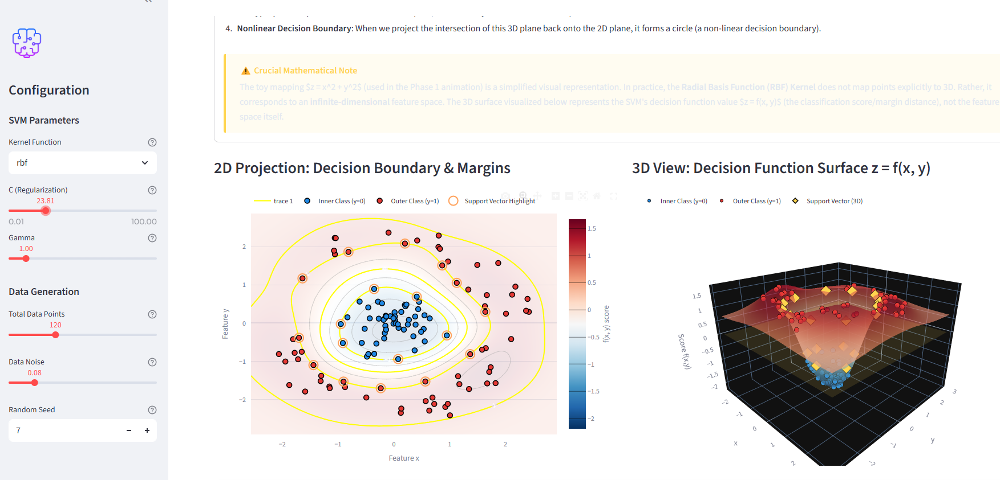

# SVM Kernel Trick 3D Interactive Demo (支持向量機核函數 3D 互動教學展示)

本專案是一個互動式的多階段教學展示系統，旨在幫助學生直觀地理解支持向量機 (Support Vector Machine, SVM) 的核函數方法 (Kernel Methods) 與核函數技巧 (Kernel Trick)。

---

## 1. 專案總覽 (Project Overview)
支持向量機 (SVM) 是一種強大的分類演算法。然而，現實世界中的數據鮮少是線性可分的。**核函數技巧 (Kernel Trick)** 是讓 SVM 能夠學習複雜非線性決策邊界的關鍵數學方法，它透過將數據投影到更高維度的特徵空間來實現這一點。

本專案包含以下三個核心教學階段：
1. **Phase 1: Manim 概念動畫** - 使用 3D 向量圖形動畫，介紹將數據從 2D 空間提升到 3D 空間的基本幾何概念。
2. **Phase 2: RBF SVM 決策曲面** - 使用 Python 繪製靜態圖表，展示實際訓練好的 RBF 核函數 SVM 在 2D 的決策邊界以及對應的 3D 決策函數曲面。
3. **Phase 3: 互動式 Streamlit 應用程式** - 互動式網頁 App，讓學生可以即時調整參數（如 $C$、$\gamma$、雜訊、數據量等），並觀察模型決策邊界、間隔 (margins) 與支持向量的變化。

---

## 2. 核心教學故事 (Educational Story)
本教學使用經典的「環形數據集 (Concentric Ring Dataset)」作為引導：
* **內圈類別 (Class 0, 藍色)**：集中在原點附近。
* **外圈類別 (Class 1, 紅色)**：呈環狀分佈在外圍。

**核心教學進程：**
1. **2D 非線性不可分**：在原始的 2D 空間中，沒有任何一條直線能將藍色內圈與紅色外圈分開。
2. **特徵映射 (Feature Mapping)**：如果我們使用特徵映射公式 $\phi(x, y) = (x, y, x^2 + y^2)$ 將每個數據點提升到 3D 空間，半徑小的藍點會留在低處，而半徑大的紅點會被抬升到高處。
3. **3D 線性可分**：在 3D 特徵空間中，我們可以用一個水平的超平面 (hyperplane) 輕易地將這兩群點分開。
4. **投影回 2D 的非線性邊界**：將 3D 水平超平面與拋物面相交的線投影回 2D 空間，會形成一個圓形，這就是我們在 2D 平面中看到的非線性決策邊界。

---

## 3. Phase 1: Manim 概念動畫
檔案：`phase1_manim_kernel_trick.py`

此腳本使用 [Manim](https://www.manim.community/) 動畫引擎渲染 3D 場景：
* 在地面平面顯示 2D 同心圓點。
* 依據拋物面公式 $z = x^2 + y^2$ 逐漸將點提升到 3D 空間。
* 繪製一個黃色半透明的水平分割平面（超平面）。
* 將其投影回 2D 空間，畫出黃色圓形決策邊界。
* 動態旋轉相機角度，讓學生獲得清晰的 3D 空間分離效果。

---

## 4. Phase 2: RBF SVM 決策曲面
檔案：`phase2_rbf_decision_surface.py`

此腳本使用 `scikit-learn` 與 `matplotlib` 訓練真實的 RBF 核函數 SVM 分類器，並繪製成圖：
* **2D 子圖**：顯示原始數據點、實線表示的決策邊界 ($f(x, y) = 0$)、虛線表示的間隔邊界 ($f(x, y) = \pm 1$)，以及被特別圈起高亮的支持向量。
* **3D 子圖**：展示決策函數曲面 $z = f(x, y)$，其中曲面的高度代表模型的分類信心值。所有訓練數據點都依據其模型預測分數繪製於該曲面上。
* 幫助學生清楚區分「教學用簡化特徵映射」與「實際 RBF SVM 決策函數曲面」的差異。
* 產出的圖表會自動儲存於 `outputs/` 資料夾中。

---

## 5. Phase 3: 互動式 Streamlit 應用程式
檔案：`phase3_streamlit_app.py`

使用 Streamlit 與 Plotly 建立的互動式網頁儀表板：
* **互動滑桿**：即時調整正則化參數 ($C$)、核函數影響範圍 ($\gamma$)、多項式核函數次數 ($d$)、雜訊與點數。
* **雙圖展示**：並排顯示 2D 與 3D 的 Plotly 互動式圖表，支持任意旋轉、縮放與懸停提示框 (hover tooltips)。
* **指標卡片**：顯示模型訓練準確率與支持向量個數。
* **動態教學提示**：根據滑桿數值即時顯示教學筆記，引導學生理解 $C$ 與 $\gamma$ 過大或過小時對模型造成的影響。

---

## 6. 安裝指南 (Installation)
請確保您的系統已安裝 Python 3.9+。

### 安裝必要套件：
```bash
pip install -r requirements.txt
```

> **關於 Manim 的說明**：若要執行 Phase 1 動畫，需要安裝 Manim 引擎。Manim 依賴系統級別的套件（如 **FFmpeg** 與 **LaTeX**，用於渲染影片與數學公式）。如果您只需要執行 Phase 2 的繪圖腳本和 Phase 3 的互動網頁，**不需要**安裝這些系統依賴，直接執行即可。
> 關於 Manim 的詳細安裝說明，請參閱 [Manim 官方安裝指南](https://docs.manim.community/en/stable/installation.html)。

---

## 7. 執行指令 (Run Commands)

### 執行 Phase 1 (Manim 概念動畫)：
低畫質快速預覽 (1080p, 15fps)：
```bash
manim -pql phase1_manim_kernel_trick.py SVMKernelTrick3D
```
高畫質輸出 (1080p, 60fps)：
```bash
manim -pqh phase1_manim_kernel_trick.py SVMKernelTrick3D
```

### 執行 Phase 2 (RBF SVM 靜態繪圖)：
```bash
python phase2_rbf_decision_surface.py
```

### 執行 Phase 3 (Streamlit 互動式網頁 App)：
```bash
streamlit run phase3_streamlit_app.py
```

---

## 8. 重要的數學提醒 (Important Mathematical Note)
> **關鍵觀念區分**：
> 特徵映射 $z = x^2 + y^2$ 僅作為教學與幾何視覺化的輔助工具，用以說明為什麼高維特徵空間能實現線性分割。真實的 RBF 核函數並不是直接將數據顯式映射到 3D 空間，它對應的是**無限維度**的特徵空間。因此，Phase 2 和 Phase 3 中的 3D 圖像展示的是決策函數 $f(x, y)$ 的數值曲面（即各點到超平面的距離/分數），而非特徵空間本身的維度。

---

## 9. 課堂展示與教學建議 (Teaching Suggestions)
* **展示線性邊界的局限**：引導學生將 Streamlit 滑桿中的核函數切換為 `linear`，觀察其在 concentric 環形數據上的表現，解釋為何其準確率只剩約 50%（因為 3D 平面無法以平直的截面切出同心圓）。
* **展示過擬合 (Overfitting)**：將核函數設為 `rbf`，並將 `gamma` 拉到極大值（例如 `8.0` 以上）。引導學生觀察決策邊界如何形成繞著各個獨立數據點的「小氣泡」，並探討為何這會導致模型泛化能力變差。
* **展示軟間隔與硬間隔 (Soft/Hard Margin)**：調大 `noise` 滑桿以產生重疊的數據類別。對比 `C = 0.1`（邊界平滑、容忍部分錯誤以換取較寬的間隔 corridor）與 `C = 100`（邊界崎嶇、為了分對每個點而扭曲變形）的差異。
